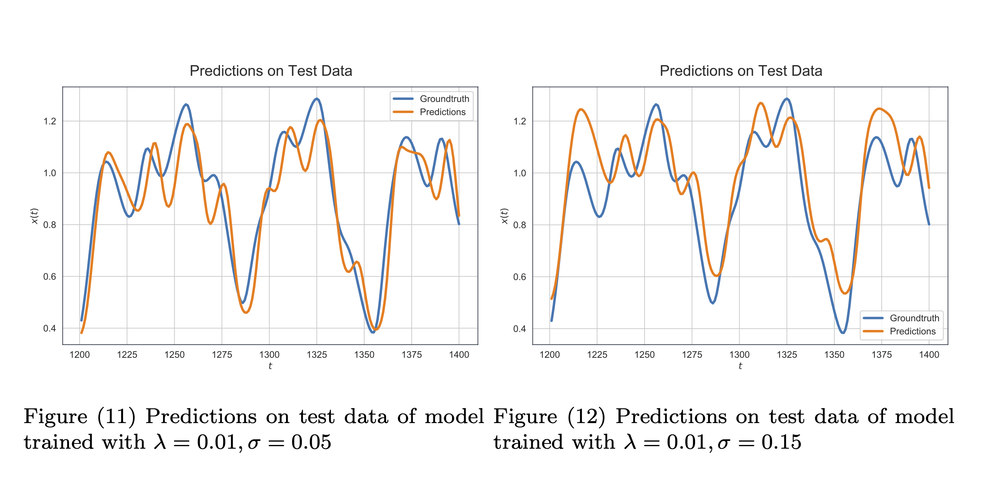

# Time Series Prediction with Multilayer Perceptron

This is a part of Assignment 1 for Course DD2437 - Artificial
Neural Networks and Deep Architectures at KTH.
--

## 1. Setup
This codebase use `poetry` as the python environment management tool,
please have it properly installed (with Python 3.8) before continuing.

## 2. Data
Our dataset is a Mackey Glass series

## 3. Running experiments

There are 3 set of experiments:
- Grid search to find an optimal three-layer perceptron architecture
- Greedy search to fina an optimal network with best performance on noisy data
- Greedy search to find a good regularization `lambda` under the present
of additive Gaussian noise in the training data
  
More details could be found in `experiment.py`